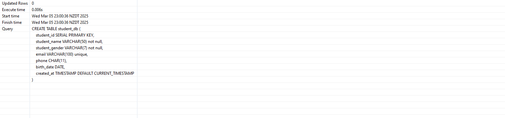
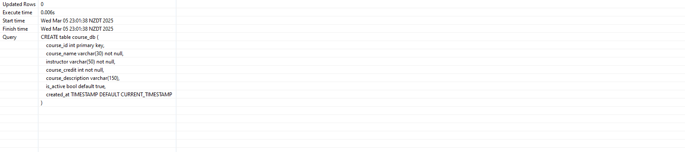
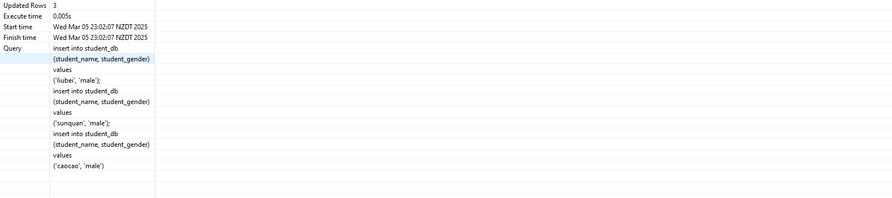
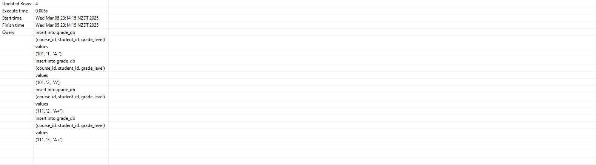
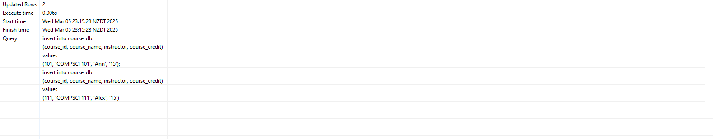
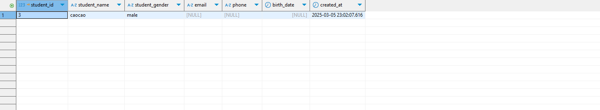
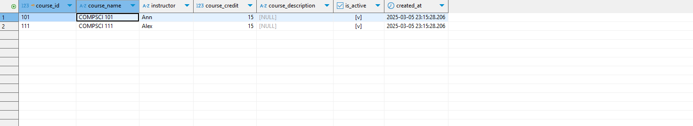
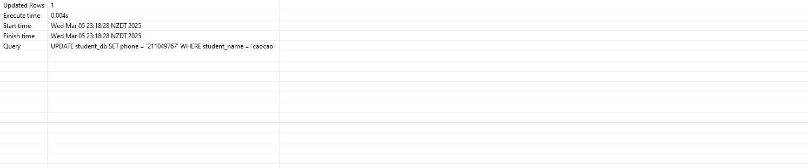
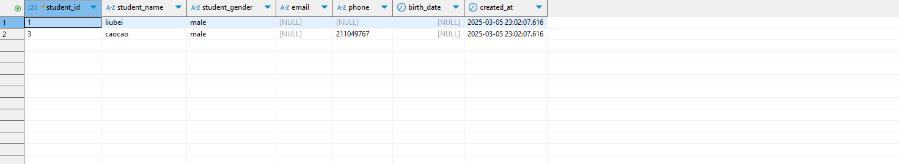

create database student_management_stm;

CREATE TABLE student_db (
    student_id SERIAL PRIMARY KEY,
    student_name VARCHAR(50) not null,
    student_gender VARCHAR(7) not null,
    email VARCHAR(100) unique,
    phone CHAR(11),
    birth_date DATE,
    created_at TIMESTAMP DEFAULT CURRENT_TIMESTAMP
);

CREATE TABLE grade_db (
    course_id int not null,
    student_id int primary key,
    grades int,
    grade_level varchar(3) not null,
    created_at TIMESTAMP DEFAULT CURRENT_TIMESTAMP
);

CREATE table course_db (
	course_id int primary key,
	course_name varchar(30) not null,
	instructor varchar(50) not null,
	course_credit int not null,
	course_description varchar(150),
	is_active bool default true,
	created_at TIMESTAMP DEFAULT CURRENT_TIMESTAMP
);

insert into student_db 
(student_name, student_gender)
values 
('liubei', 'male');

insert into student_db 
(student_name, student_gender)
values 
('sunquan', 'male');

insert into student_db 
(student_name, student_gender)
values 
('caocao', 'male');

insert into grade_db 
(course_id, student_id, grade_level)
values
(101, '1', 'A-');

insert into grade_db 
(course_id, student_id, grade_level)
values
(101, '2', 'A');

insert into grade_db 
(course_id, student_id, grade_level)
values
(111, '2', 'A+');

insert into grade_db 
(course_id, student_id, grade_level)
values
(111, '3', 'A+');

insert into course_db 
(course_id, course_name, instructor, course_credit)
values
(101, 'COMPSCI 101', 'Ann', '15');

insert into course_db 
(course_id, course_name, instructor, course_credit)
values
(111, 'COMPSCI 111', 'Alex', '15');

select * from student_db
where student_name like '%c%';

select * from course_db;

UPDATE student_db SET phone = '211049767' WHERE student_name = 'caocao';

delete from student_db where student_name = 'sunquan';

select * from student_db;
