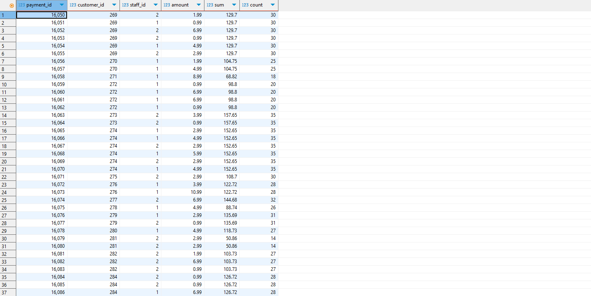

-- 3.12a Show only those movie titles, their associated film_id and replacement_cost with the lowest replacement_costs for in each rating category – also show the rating.
`
select 
title, 
film_id, 
replacement_cost, 
rating
from
film f1
where
f1.replacement_cost = 
(select min(replacement_cost) 
from film f2
where f2.rating = f1.rating)
order by f1.rating
`

-- 3.12a Show only those movie titles, their associated film_id and the length that have the highest length in each rating category – also show the rating.
`
select
title, 
film_id, 
length, 
rating
from 
film f1
where
f1.length = 
(select max(length)
from film f2
where f1.rating = f2.rating)
order by f1.rating
`

--  3.12a Show all the payments plus the total amount for every customer as well as the  number of payments of each customer.
`select 
payment_id, 
customer_id, 
staff_id, 
amount, 
(select sum(amount) from payment p2 where p2.customer_id = p1.customer_id) as sum_amount, 
(select count(*) from payment p3 where p3.customer_id = p1.customer_id ) as count_payments
from
payment p1
`

--  3.12a Show only those films with the highest replacement costs in their rating category plus show the average replacement cost in their rating category
`
select
title,
replacement_cost,
rating,
(select avg(replacement_cost) from film f2  where f2.rating = f1.rating)
from
film f1
where
f1.replacement_cost = 
(select max(replacement_cost)
from
film f3
where 
f3.rating = f1.rating)
`

--  3.12a Show only those payments with the highest payment for each customer's first  name - including the payment_id of that payment.
--  How would you solve it if you would not need to see the payment_id?
-- 无法去重
`
SELECT c.first_name, (select sum(amount) from payment p2 where p.customer_id = p2.customer_id ), p.customer_id 
FROM payment p
JOIN customer c ON p.customer_id = c.customer_id
`

-- Group by去重，但这里为什么要再group by c.customer_id, group by 后跟的东西有什么要求
`
select
c.first_name,
p.amount,
p.payment_id 
from
payment p 
join
customer c 
on
c.customer_id = p.customer_id
where
p.amount = 
(select
max(amount)
from 
payment p1
where
p1.customer_id = p.customer_id 
)

`
